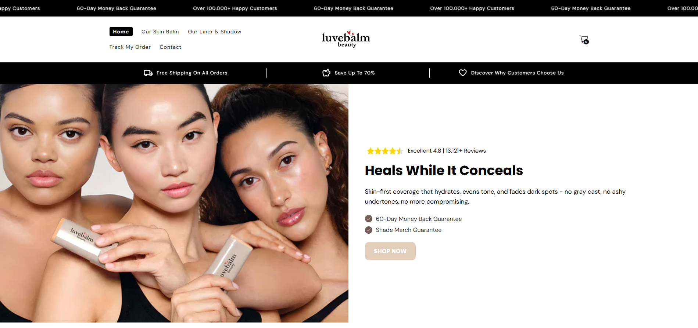
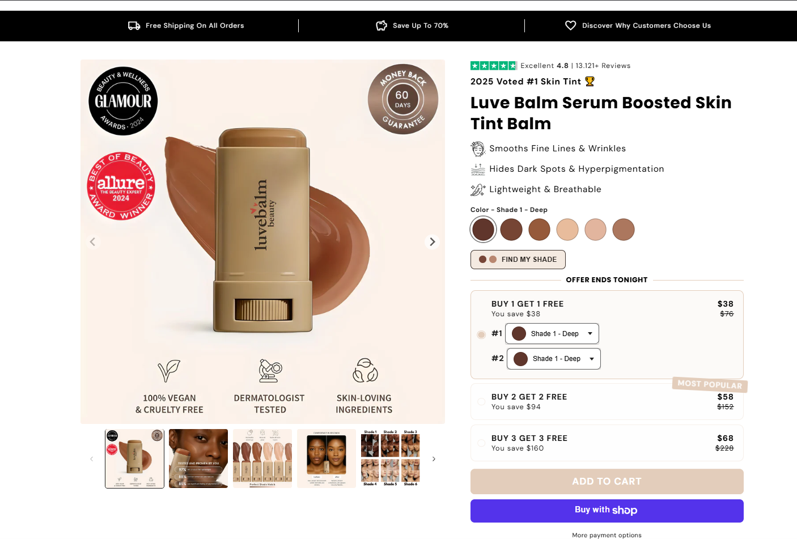
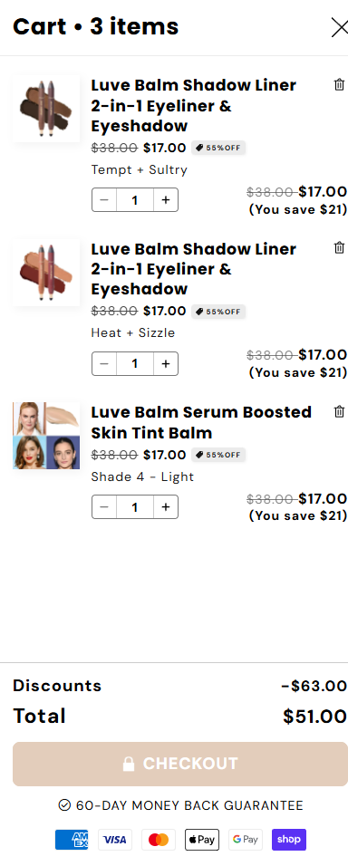
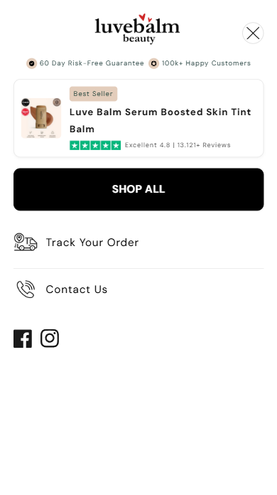
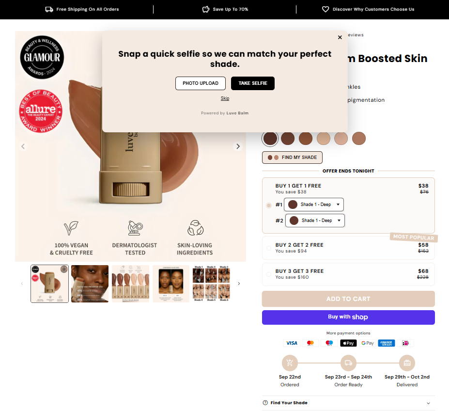
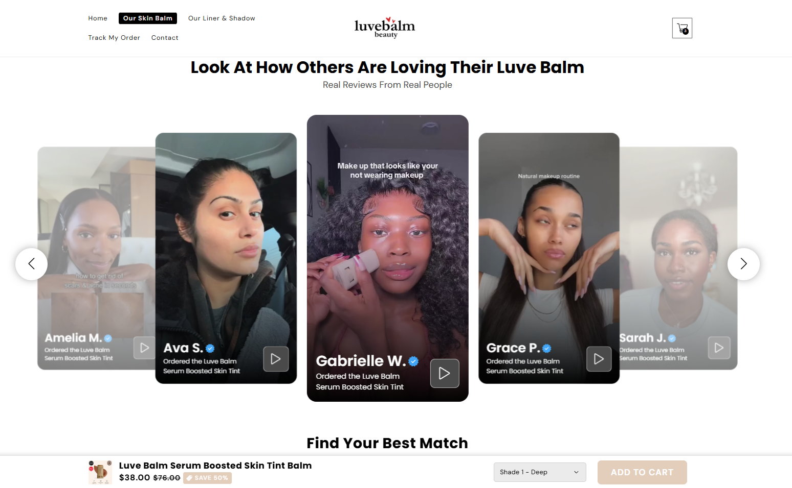
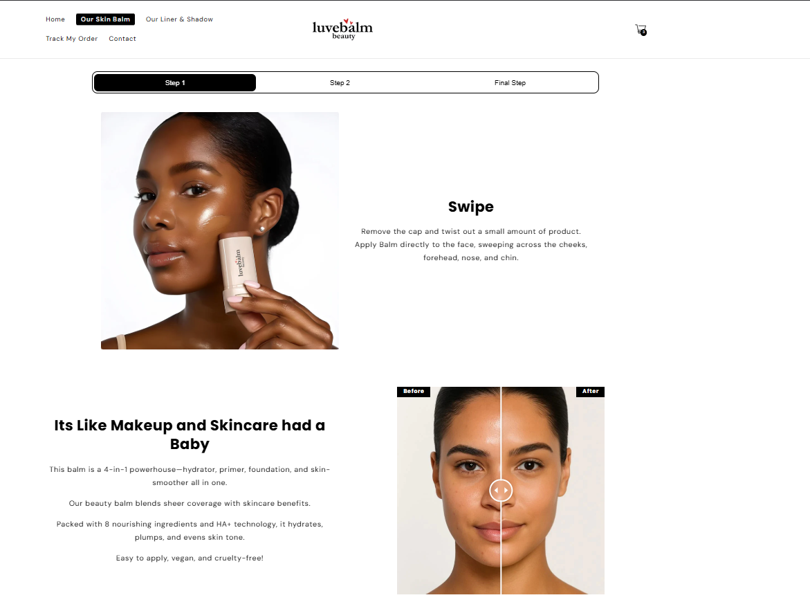
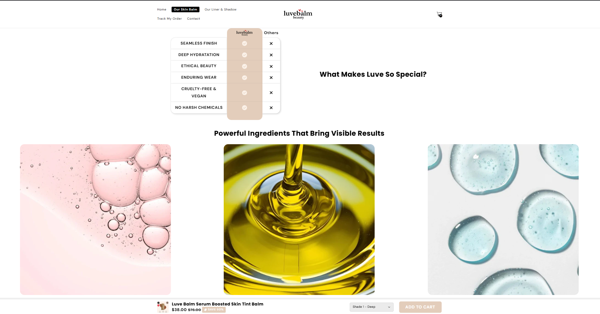

# 🛒 Shopify Store Luvebalm

Tienda online desarrollada con **Shopify**, personalizada con Liquid, HTML, CSS y JavaScript.  
Incluye integraciones externas, diseño responsive y optimización para conversión.

🔗 **[Ver tienda en vivo](https://luvebalm.com)**

---

## 🚀 Tecnologías utilizadas
- Shopify (Liquid templates)
- HTML, CSS, JavaScript
- Integraciones: Loox, Clarity, Meta Pixel
- Diseño responsive optimizado para móvil

---

## 📸 Capturas de pantalla

### 🏠 Home

### 📦 Página de producto

### 💳 Checkout

---

## 🎨 Personalizaciones y secciones

### Drawer personalizado

### Skin App personalizado

### Secciones destacadas
  
  

---

## ✨ Funcionalidades destacadas
- Creación y personalización completa de la tienda desde cero.  
- Customización avanzada de theme en **Liquid**.  
- Integración de apps de reseñas, analítica y marketing.  
- Configuración de métodos de pago y envíos.  
- Optimización de la experiencia de usuario y la conversión.  

---

## 📌 Sobre el proyecto
Este proyecto forma parte de mi portafolio como **Cloud & Full-Stack Developer in progress**.  
El objetivo fue construir una tienda online escalable, moderna y lista para captar clientes.
